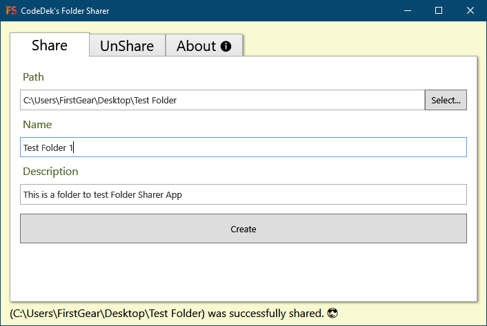
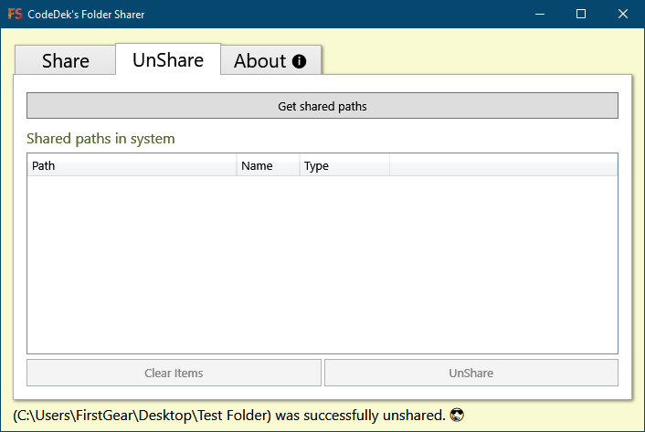
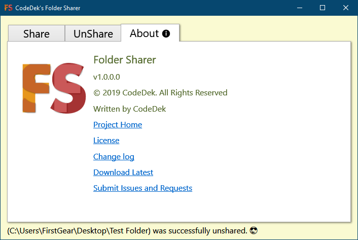

# CodeDek's Folder Sharer

Easily share or unshare any folder in windows.
Scroll down to the [downloads](#downloads) section to get a specific version and to view its change log, or just go to [releases](https://github.com/codedek/CodeDek.FolderSharer/releases) to get the latest.

### License & Copyright
© 2019 CodeDek. All Rights Reserved.
Licensed under the [GPL-3.0](LICENSE).

### Dependencies
- [.NET Framework 4.6.1](https://dotnet.microsoft.com/download/dotnet-framework/net461) (Required to be installed on your machine)

## Features
### How to Share a Folder
1. Press the Select button to select a path/folder
2. Enter a Name [Optional]
3. Enter a Description [Optional]
4. Click the Create button

### How to Unshare a Folder
1. Press the Get Shared Paths button
2. Select the path to that you want to unshare from the list
3. Click the UnShare button

- The Clear Items Button clears the items from the list.

### About
- This displays information about the app, its website, source and updates.

### Submit Issues or Requests
If you have any issues or requests, you can submit your [issues here](https://github.com/codedek/CodeDek.FolderSharer/issues).

### Downloads
[Version 1.0](https://github.com/codedek/CodeDek.FolderSharer/releases/tag/v1.0) **-** [Change log](CHANGELOG.md)

